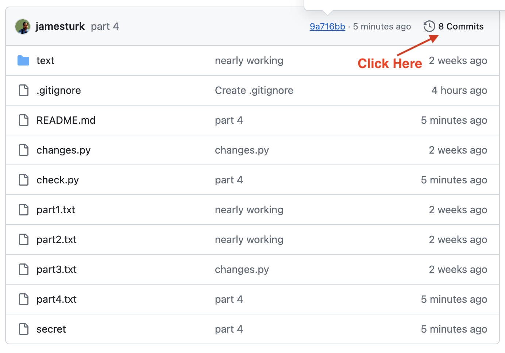

.. _day2_practice:

Day 2 Git Lab
======================

Accessing your practice repository
----------------------------------

To access the practice repository for today's exercise you will need to
accept an invitation to join the course organization.

**Step 1**

First, check to see if you have a pending organization invite:

<https://github.com/settings/organizations>

**If you have a pending invite, please accept it.**
If this page already lists the uchicago-capp-camp organization, there is nothing you need to do.
If you have neither, please let us know.

Next, visit <https://github.com/orgs/uchicago-capp-camp-2026/repositories> and ensure that you can
see a repository named ``intro-git-lab-YOUR_USERNAME``.

This should have been automatically created.
If you do not see it, check <https://github.com/notifications> for another invitation to accept.

**Step 2**

Once your repository has been created, Open a terminal/WSL window and then please navigate to your ``~/capp-camp-files`` directory.

**Step 3**

In your ``~/capp-camp-files`` directory, clone your repository by running the following command:

::

   $ git clone git@github.com:uchicago-capp-camp-2026/intro-git-lab-GITHUB_USERNAME.git

where ``GITHUB_USERNAME`` is replaced by your GitHub username.

**Step 4**

Change to your ``intro-git-lab-GITHUB_USERNAME`` directory.

Part 1 - Making a First Commit
------------------------------

Like yesterday's lab, today's lab will ask you to take some steps with git and run a ``check.py`` script as you go.

Whenever you have made a change that you wish to keep, you'll make a git commit.

Open up ``part1.txt`` using ``code``, answer the questions, and save the file!

**NOTE**: Forgetting to save your changes in the editor is a common mistake. Remember to save in VS Codium!

When you've done so, add a commit with the message "part 1 done."

Run ``uv run python check.py 1`` to check that your commit exists and is correct.

Part 2 - Making & Reverting Changes with ``git restore``
---------------------------------------------------------

Open up the file ``part2.txt`` and make the modifications it describes. (Do not commit them yet!)

Run the command ``uv run python check.py 2`` which will verify that these changes are made.

Once you've run this command, undo the changes using git restore and run ``uv run python check.py 2`` again.

Part 3 - Viewing Changes with ``git diff``
------------------------------------------

Run the command ``uv run python changes.py`` this will make some changes to your local files, but will not commit them. (Do not commit them either!)

Then take a look at these changes with ``git diff``, open up ``part3.txt`` and answer the questions based on the changes you see.

Be sure to commit your changes! Run the command ``uv run python check.py 3`` to verify that you have committed your changes.

Part 4 -- Push your changes to GitHub
--------------------------------------

Have a look at your repository on GitHub.  Open a browser window to: ``https://github.com/uchicago-capp-camp-2026/intro-git-lab-GITHUB_USERNAME``, where ``GITHUB_USERNAME`` is replaced by **your** GitHub username.  Do you see your changes?  No!  Why?

Now use the ``git status`` command to verify that all your changes have been committed.  

We'll use the the git push command to transfer or "push" a commit made on a local branch on your computer to the corresponding branch of a remote repository.

The syntax for this command is: ``git push <remote_repo_name> <remote_repo_branch_name>``.
By default, remote repositories are given the name "origin", which we saw when we ran ``git remote -v``. The new default branch is "main".  So the full command would be: ``git push origin main``.  Run this command now.

If your push succeeded, your changes should now be visible on GitHub.

Run the command ``uv run python check.py 4`` to verify that you have pushed your changes.

Part 5 - Finding a Change in the ``git log``
---------------------------------------------

The answer to part 5 is in the git history. Use ``git log`` to find the necessary information.

You'll see that each commit has a value, known as a hash, like 'de8e74bc2c3ec106554440021efd1ec6808486c2'.
These values uniquely identify each commit.

These hash vaues can be used with ``git show <hash-id>`` to see what changed in a given commit or with ``git diff <hash-id> <another hash-id>`` to see the differences between two commits.

**Tip:** If you are typing hashes instead of copying & pasting, you can type the first 4-5 characters instead of the entire thing.

Use ``git log`` to discover the hash for the commit labeled "part 1 done" and add the full text of this hash to ``part5.txt``. You may use ``uv run python check.py 5`` to confirm.

You can also try this using the GitHub interface which offers an alternative interface to view the log:

Part 6 -- Push your changes to GitHub
--------------------------------------

Create a commit for the changes you made in Part 5 and push it to GitHub. 

Hint: you used ``git push origin main`` to push your first commit to GitHub.  You can use ``git push`` for subsequent pushes of this repository.

Now use the ``git status`` command to verify that all your changes have been committed and pushed.  If the result of this command does not show any changes to be committed or untracked files and includes the line ``Your branch is up to date with 'origin/main'.``, then you are all set!
