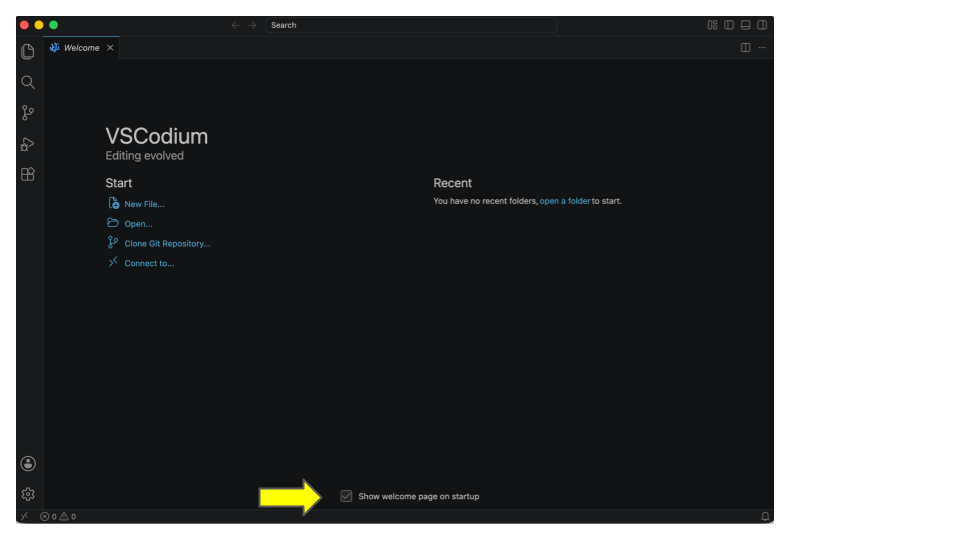
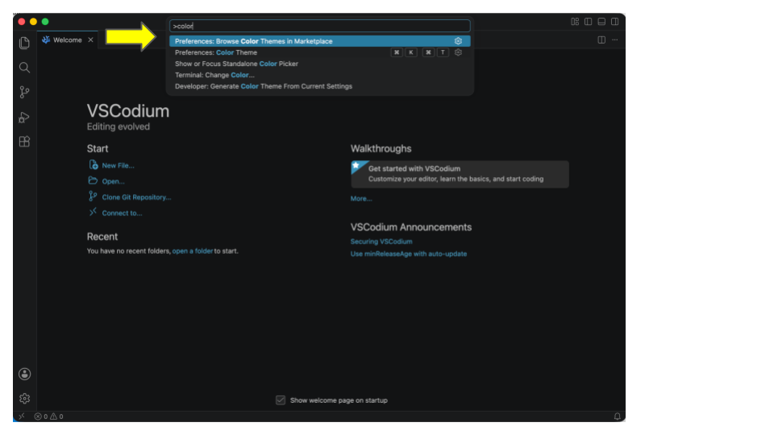
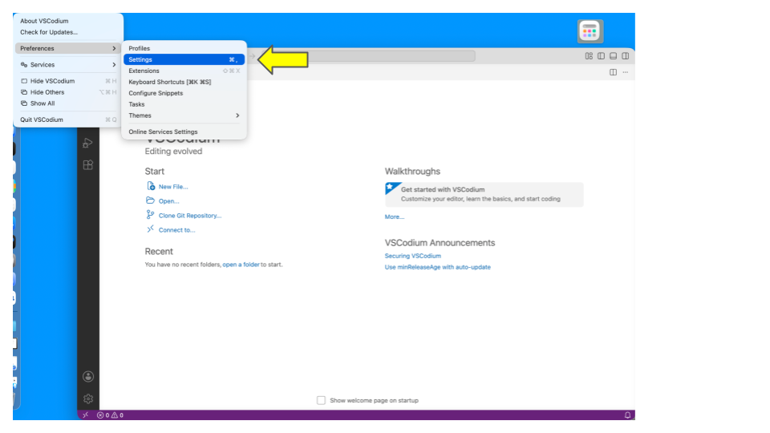
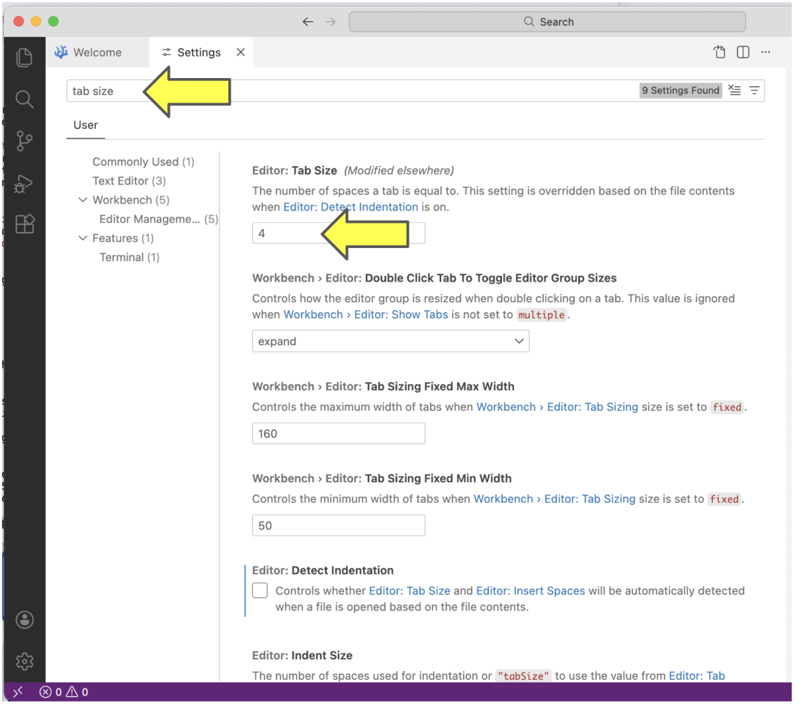
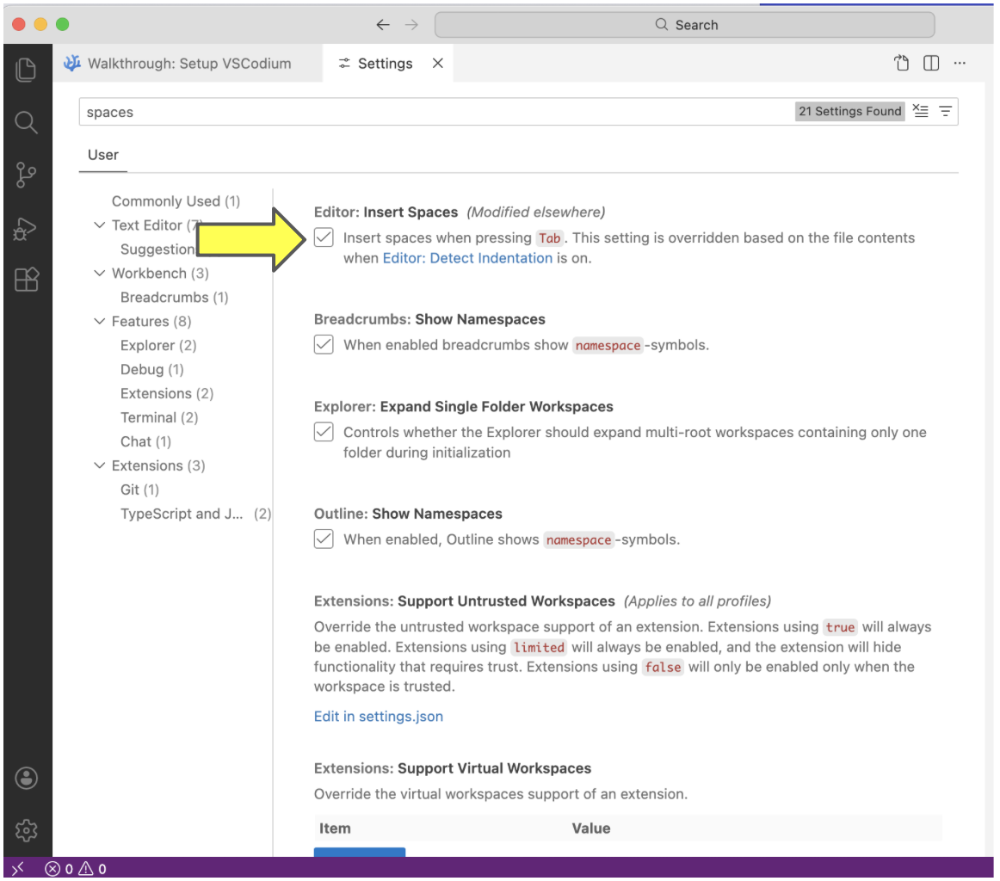
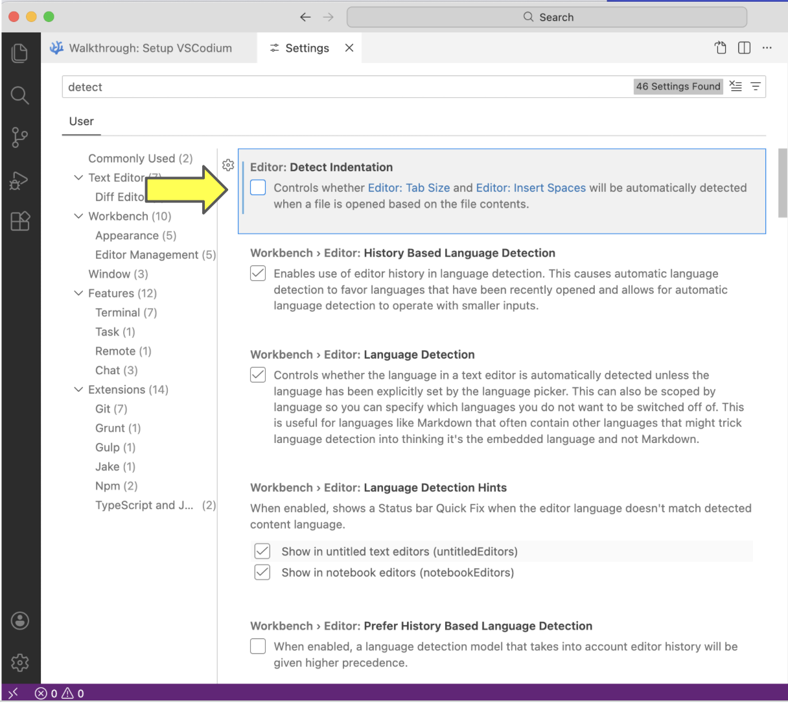
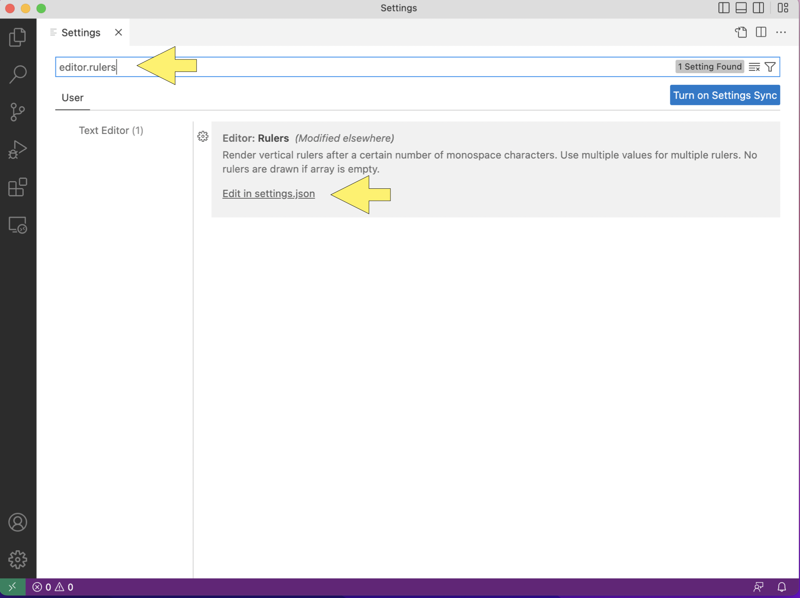
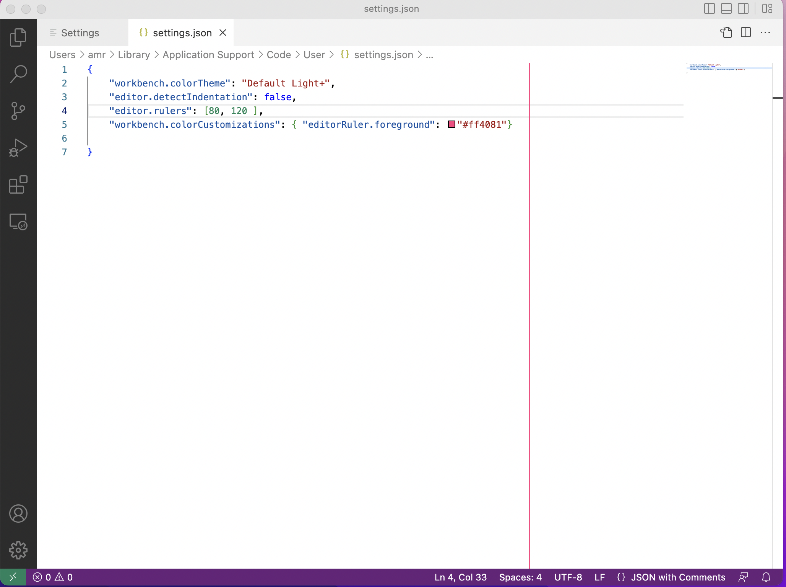
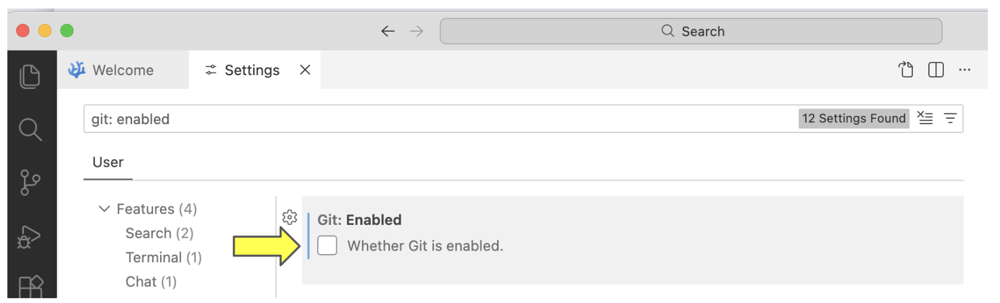
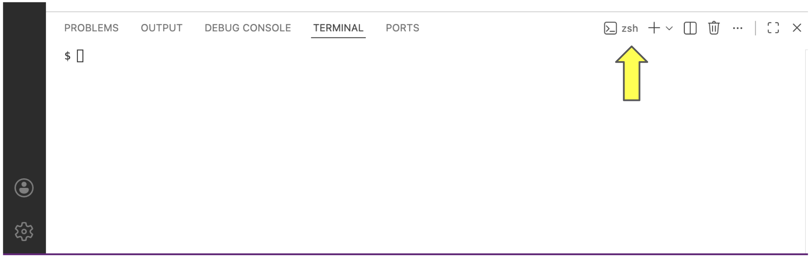

:orphan:

.. _vscodium-about:

========
VSCodium
========

Your `code editor
<https://en.wikipedia.org/wiki/Source-code_editor>`__ will be an
indispensable tool for the CS classes that are part of the CAPP
core.

While you are welcome to use whatever code editor works best for you,
we recommend using VSCodium. VSCodium is an offshoot of VSCode. VSCode
is a popular because it is a fairly beginner-friendly and a very
powerful tool once you familiarize itself with all its bells and
whistles.

VSCodium is well suited for a variety of programming languages; if you
become fluent in using VSCodium with Python and then need to edit some
C or Java code, you will be able to continue to use the same editor.
Also, VSCodium is free! You won’t have to pay anything to use it.

VSCodium contains the very same source code as VSCode --- that is, it
is the same program --- but it removes aggressive code-assistance
tools and the telemetry that transmits what you are doing in VSCode to
Microsoft in real time.

**We very strongly discourage you from using VSCode in your CS courses.**

In this section, we provide instructions on how to install VSCodium and
provide a list of useful VSCodium tips.

In the instructions below, the ``$`` signals the Linux command-line
prompt. It should not be included when you run the listed commands.

.. _vscodium-install:

Installing VSCodium
-------------------

Please follow the instructions for your operating system.

MacOS
~~~~~

The instructions for MacOS assume you have installed
installed the Homebrew package manager.  If you have not installed
Homebrew please do so now.  See this `Ed Post
<https://edstem.org/us/courses/101439/discussion/8194166>`__ for
instructions.

Open a terminal window and run the following at the command-line:

::

   $ brew install --cask vscodium

Once this command is complete, you will be able to launch VSCodium
from the application launcher or by running the ``codium`` command at
the command-line.

Windows
~~~~~~~

ADD THE CORRECT INSTRUCTIONS!

Once this command is complete, you will be able to launch VSCodium
running the ``codium`` command at the WSL command-line.

Linux
~~~~~

You should be able to install VSCodium on Linux by typing the
following command at the command-line prompt of a terminal window:

``$ sudo apt update && sudo apt install codium``

If this doesn't work, please ask an instructor or staff member for
assistance.
	     
.. _vscodium-config:

Configuring VSCodium
--------------------

In this section, you will find instructions on how to set some common
configuration options for VSCodium. Some of these changes will make it
easier to conform to the `Python style guide
<https://uchicago-cs.github.io/student-resource-guide/style-guide/python.html>`__
that will be used in many of your CS courses.  Others will make it
less likely that you will run into difficult-to-diagnose Git problems.

The first time you open VSCodium you will see a Welcome page:

Take a minute and uncheck the "Show welcome page on startup" box, if you
don't want to see this page every time to figure up VSCodium.

Short cuts
~~~~~~~~~~

We recommend several keyboard shortcuts below.  The shortcuts for
Windows and Linux typically use the control key (written as Ctrl).
For example, the shortcut for opening the command palette is written
as: Ctrl-Shift-P, that is press the control key, the shift key, and p
at the same time.  For most shortcuts, MacOS users will replace the
control key with the command key.  For example, MacOS users would use
Cmd-Shift-P instead of Ctrol-Shift-P.  We include both style of
shortcuts below. Please make sure to use the one for your operating
system.

Themes
~~~~~~

The default theme uses white text on a black background.  This section
contains instructions on how to to change to a different theme.

Open the command palette using the the keyboard shortcut Ctrl-Shift-P
(or Cmd-Shift-P on MacOS).  Once it is open, you can just start typing
the name of a command.  Type in the word ``color`` and you will be
offered several options. Choose: ``Preferences: Color Theme`` and then
choose whichever option you prefer.

TODO: add figure with the color theme options.

Spaces, Tabs, etc
~~~~~~~~~~~~~~~~~

In this section, you will set a few options related to tabs and
spaces.

To get started, in the *VSCodium* menu, go to *Preferences...*,
*Settings*.

First, verify that tab size is set to four spaces. Select *Commonly
Used* and then either scroll down and look for *Editor: Tab Size* or
type "Tab Size" in the search bar. If you see a value other than ``4``
as the value of *Editor: Tab Size*, change it to ``4``.

Next, set tabs as spaces. Go to *Commonly Used* again, search for
space, and then check the box next to *Editor: Insert Spaces*.

Lastly, turn off detect indentation. Search for detect, and then
uncheck the box next to *Editor: Detect Indentation*.

	       

Rulers
~~~~~~

Your code should, generally, not have lines longer than 80
characters. To make sure you do not exceed this limit, you will turn
on *Rulers*. Search the settings for *Editor: Rulers*.

Open the *settings.json* file.  The file will contain some information
about your theme and other settings.

Find the last item in the outer set of curly braces and add a comma at
the end of the item. Then add the code shown below. (VSCodium may try
to be helpful and include some of this text for you.)

.. code-block::

    "editor.rulers": [ 80, 120 ],
    "workbench.colorCustomizations": {
        "editorRuler.foreground": "#ff4081"
    }

When you are finished, the result should look like this:

(If you have set other settings, you may see additional information in
the file.)

Make sure to save the file using ``Ctrl-s``, if you are using a
Windows or Linux Machine or ``Cmd-s``, if you are using a MacOS
machine.  If your changes worked properly, you will see a vertical
line at 80 characters.  If your VSCodium window is sufficiently wide,
you will see a second vertical line at 120 characters.

Close this tab, by clicking the ``X`` next to ``settings.json``.

Turning off Git Integration
~~~~~~~~~~~~~~~~~~~~~~~~~~~

Git is a version control system used in many CS courses at
UChicago.

By default, VSCodium has tools for working with Git installed.  While
this integration can be helpful for programmers who have a good
understanding of Git, it can cause problems for new programmers.  As a
result, we would like you to it turn off.

To turn off Git integration, open the VSCodium settings panel by using
the menu as you did in the previous section or using the keyboard
shortcut ``Ctrl-+ (press the control key and the plus sign),``
(``Cmd-+,`` for MacOS users). It may also be open in a tab from your
work on the previous configuration tasks.

In the settings search bar, type ``git: enabled``. Make sure that its
checkbox is *unchecked*.

Once you have unchecked the box, you can close the settings panel
by clicking the ``X`` in the ``Settings`` tab.

(Later, once are you comfortable with using Git for solo projects and
group projects, you can turn Git integration back on.)

Terminal
~~~~~~~~

In this section, you will set up the shell to use in VSCodium's
built-in terminal.

**Windows**

If you are running on a Windows machine and you have installed WSL
("Windows Subsystem for Linux"), then you are ready to continue. If
not, return to this step after having done so. If you are on a Linux
or MacOS machine, you will have an appropriate shell already.

To make sure that Bash is set up as your default shell in VSCodium,

#. open the integrated terminal by pressing :code:`Ctrl-Shift-``,
#. click on the drop down next to the plus sign, and
#. click *Select Profile*, and
#. select *Ubuntu (WSL)*.

**MacOS**

It is likely that the terminal is already set up to use ``zsh``, the
default shell on MacOS.  Open the integrated terminal by pressing
:code:`Ctrl-Shift-`` and then click on the drop down next to the plus
sign.  You should see ``zsh`` listed as the shell:

      

**Linux**

It is likely that the terminal is already set up to use ``bash``, the
default shell on Linux.  Open the integrated terminal by pressing
:code:`Ctrl-Shift-``.  You should see ``bash`` listed as the shell:

Running codium from the command-line
~~~~~~~~~~~~~~~~~~~~~~~~~~~~~~~~~~~~~~

VSCodium can be launched from the command-line using the ``codium``
command.  The installers for both MacOS and Windows install this
command-line tool by default.

