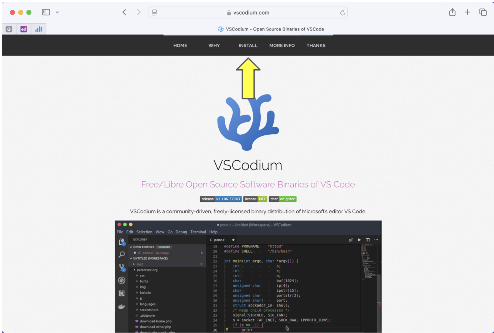
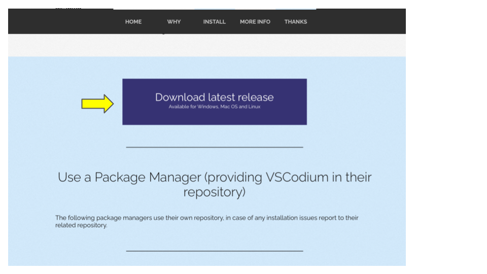
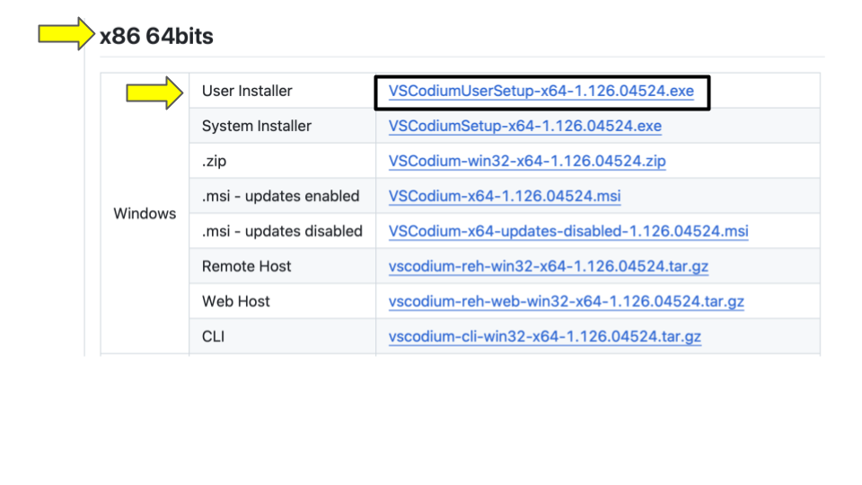
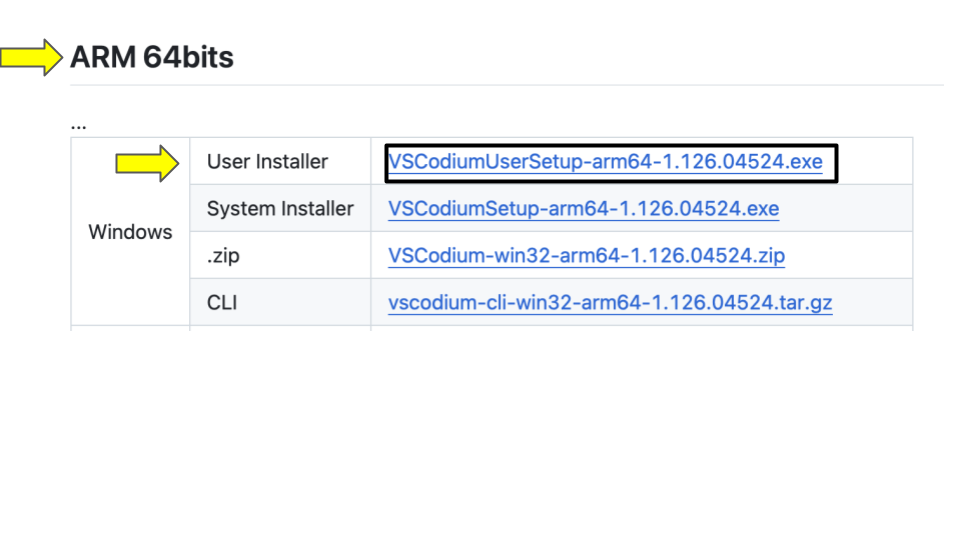

:orphan:

.. _vscodium-about:

========
VSCodium
========

Your `code editor
<https://en.wikipedia.org/wiki/Source-code_editor>`__ will be an
indispensable tool for the CS classes that are part of the CAPP
core.

While you are welcome to use whatever code editor works best for you,
we recommend using VSCodium. VSCodium is an offshoot of VSCode. VSCode
is a popular because it is a fairly beginner-friendly and a very
powerful tool once you familiarize itself with all its bells and
whistles.

VSCodium is well suited for a variety of programming languages; if you
become fluent in using VSCodium with Python and then need to edit some
C or Java code, you will be able to continue to use the same editor.
Also, VSCodium is free! You won’t have to pay anything to use it.

VSCodium contains the very same source code as VSCode --- that is, it
is the same program --- but it removes aggressive code-assistance
tools and the telemetry that transmits what you are doing in VSCode to
Microsoft in real time.

**We very strongly discourage you from using VSCode in your CS courses.**

In this section, we provide instructions on how to install VSCodium and
provide a list of useful VSCodium tips.

In the instructions below, the ``$`` signals the Linux command-line
prompt. It should not be included when you run the listed commands.

.. _vscodium-install:

Installing VSCodium
-------------------

Please follow the instructions for your operating system.

MacOS
~~~~~

The instructions for MacOS assume you have installed
installed the Homebrew package manager.  If you have not installed
Homebrew please do so now.  See this `Ed Post
<https://edstem.org/us/courses/101439/discussion/8194166>`__ for
instructions.

Open a terminal window and run the following at the command-line:

::

   $ brew install --cask vscodium

Once this command is complete, you will be able to launch VSCodium
from the application launcher or by running the ``codium`` command at
the command-line.

Windows
~~~~~~~

First, you will need to determine whether your Windows computer has an
Intel or an ARM processor. Go into "Settings", then
"System", then "About." Under "Processor", if you see something like
"Intel Core Ultra 5 235U", the key word here being "Intel", then you
have an x86 processor. This is the most likely case.

Go to https://vscodium.com.

Click "INSTALL" at the top of the page:

Click "Download latest release":

Scroll down past the release notes to the table.

If you have an x86 computer, find the ``Windows`` section of the table
under ``x86 64bits``. The first row of the table says ``User
Installer``. At the time of this writing (November 27th, 2025), the
relevant file to download is
``VSCodiumUserSetup-x64-1.126.04524.exe``. Note that this is a moving
target and the exact filename is likely to change. But it should be
something like what is stated here.

If you have an ARM processor, then look in the ``ARM 64bits`` table a
little further down the page for the corresponding ``User Installer``.

Download the ``exe`` file you identified as appropriate for your
machine and then double click on it to run the installer.  You be
asked to accept a Terms of Use agreement and about where to install
the application, etc. Please accept all defaults and allow the
installer to run to completion.

Once this command is complete, you will be able to launch VSCodium
running the ``codium`` command at the WSL command-line.

Linux
~~~~~

You should be able to install VSCodium on Linux by typing the
following command at the command-line prompt of a terminal window:

``$ sudo apt update && sudo apt install codium``

If this doesn't work, please ask an instructor or staff member for
assistance.
	     

